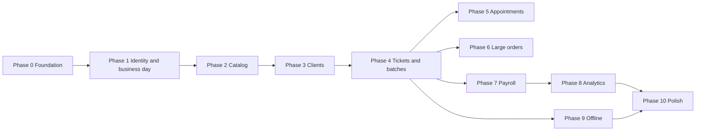

# Project plan — work breakdown

This plan divides work into **phases** with **deliverables** and **dependencies**. Order matters most for: **auth → catalog → daily operations → money → reporting → offline**.

---

## Phase 0 — Foundation

| Work package | Output |
|--------------|--------|
| Monorepo scaffold | Turborepo (or equivalent) with Next.js app, shared `packages/` for types and utils |
| Repo standards | ESLint, Prettier, TypeScript strict mode, env sample (no secrets committed) |
| Infrastructure | Vercel project, Postgres provider (Neon / Supabase / RDS), migration tool (Prisma / Drizzle / Kysely) |
| RBAC matrix | Roles in DB + code: cashier/admin, secretary, stylist (with subtype), clothier |
| Real-time layer | Choose and spike WebSocket vs SSE provider for live cashier dashboard updates |

**Exit criteria:** App deploys to staging; DB connects; empty authenticated shell per role.

---

## Phase 1 — Identity, employees, and business day

| Work package | Output |
|--------------|--------|
| Auth | Login, session, password reset; only admin creates accounts |
| Employee profiles | Link user ↔ role; stylist subtype field; fixed daily rate for secretary; active/deactivated flag |
| Employee visibility flag | Admin toggle: show/hide own earnings per employee |
| Vacation / absence | Calendar model: vacation, approved absence, no-show; "who works today" query |
| Business day open / close | Admin button to open and close the day; all records stamped with business day ID, not calendar date |
| Employee deactivation | Deactivate (preserve history); termination payment shortcut; block deactivation if unsettled pay exists |

**Exit criteria:** Admin can open/close the day; create and deactivate employees; system knows who is available.

---

## Phase 2 — Catalog and pricing

| Work package | Output |
|--------------|--------|
| Service catalog | Service name, variants (e.g. hair length), customer price, commission % per variant |
| Cloth piece catalog | Piece type, customer sale price, clothier unit pay |
| Permissions | Only cashier/admin can create/edit catalog entries; full audit log (who changed what, when) |

**Exit criteria:** All service and piece types are CRUD-able with an audit trail; commission % is stored per service variant.

---

## Phase 3 — Client records

| Work package | Output |
|--------------|--------|
| Saved client | Name, ID, contact info (phone/email), full history, no-show count |
| Guest | Name-string only; no persistent record |
| Client search | Cashier/secretary can search saved clients by name or contact info at ticket/appointment creation |

**Exit criteria:** A saved client can be searched and linked to a ticket or appointment; guest flow skips all of this.

---

## Phase 4 — Daily operations: tickets, checkout, cloth batches

| Work package | Output |
|--------------|--------|
| Ticket creation | Any of: stylist, secretary, cashier creates ticket (employee + service variant + client or guest) |
| Ticket lifecycle | `logged → awaiting payment → closed`; reopened by cashier only; earnings recomputed on reopen |
| Cashier dashboard | Real-time view of all open tickets grouped by employee; live updates (WebSocket / SSE) |
| Checkout | Line item(s), total, payment method(s) (cash / card / transfer, split allowed); close ticket |
| Price override | Cashier can override price at checkout; reason stored in DB; not visible in frontend UI |
| Edit approval flow | Stylist or secretary submits an edit → cashier receives approval request → approves or rejects |
| Walk-in flow | No appointment required; start from ticket creation directly |
| Cloth batches | Secretary/admin creates batch; assigns pieces to clothier(s) per-piece or whole-batch |
| Piece completion | Clothier marks done → secretary/admin approves (or admin marks done directly) |
| In-app notifications | Clothier notified on new assignment; stylist notified on new appointment |

**Exit criteria:** Full service-to-payment loop works end to end; cashier dashboard updates live; cloth batches assignable.

---

## Phase 5 — Appointments

| Work package | Output |
|--------------|--------|
| Appointment booking | Client (saved or guest), service summary, stylist, date + time |
| Double-booking prevention | System rejects overlapping time slots for the same stylist |
| Appointment states | `booked → confirmed → completed / cancelled / rescheduled / no-show` |
| No-show tracking | Recorded against saved client profile; guest no-shows not tracked |
| Confirmation flag | Manual "confirmed" toggle in MVP; external channel (email/SMS) deferred |

**Exit criteria:** Secretary can book, confirm, and manage appointments; double-booking is blocked.

---

## Phase 6 — Large cloth orders

| Work package | Output |
|--------------|--------|
| Order record | Client (saved), description, total price, deposit paid, balance owed, assigned clothier(s), status |
| Order → batch link | Batches created under a large order; order status derived from batch progress |
| Order status flow | `pending → in production → ready → delivered → paid in full` (secretary/admin updates) |
| ETA visibility | Cashier/admin can see order progress to communicate ETA to client |

**Exit criteria:** A large client order can be tracked from deposit through full payment without spreadsheets.

---

## Phase 7 — Payroll settlement and audit

| Work package | Output |
|--------------|--------|
| Earnings computation | Stylist: sum of commissions from closed tickets; clothier: sum of approved piece pays; secretary: daily rate × days worked |
| Payout records | Amount, date paid, period covered, payment method (cash / transfer); per employee |
| Prevent double-pay | Block settling the same period twice per employee |
| Admin review screen | Filter by employee and date range; mark settled |
| Unsettled flag | Surface any employee with open unpaid earnings |

**Exit criteria:** Admin can pay any employee with a full audit trail; no period can be double-settled.

---

## Phase 8 — Analytics

| Work package | Output |
|--------------|--------|
| Revenue dashboard | Day / week / month totals + comparison to prior equivalent period |
| Employee performance | Jobs count per employee; earnings per employee; both with period comparison |
| Indexes and query opt. | Ensure report queries stay fast on realistic data volumes |
| CSV export (stretch) | Export for accountant |

**Exit criteria:** Admin can answer "how did we do vs last week?" and "who earned what this month?" without manual work.

---

## Phase 9 — Offline / sync hardening

| Work package | Output |
|--------------|--------|
| Offline policy doc | Which actions are offline-capable vs online-only (checkout = online-only for payment; service logging = offline-capable) |
| IndexedDB local queue | Queue mutations locally with stable client-generated IDs |
| Sync status UI | Indicator showing pending / synced / failed items |
| Idempotent API | Idempotency keys on all mutating routes; Postgres-backed deduplication |
| PWA | Web App Manifest, service worker (Workbox), install prompt on supported devices |

**Exit criteria:** Stylist logs are not lost on flaky connections; no duplicate tickets or double charges after reconnect.

---

## Phase 10 — Polish and rollout

| Work package | Output |
|--------------|--------|
| Responsive QA | Test all role flows on phones and desktop |
| Performance pass | Loading states, optimistic UI, slow-connection testing |
| Error tracking | Sentry (or equivalent) integrated |
| Backups and monitoring | DB backup policy; uptime monitoring on Vercel |
| Training material | Short internal guide (one page per role) |

---

## Dependency graph

---

## Suggested MVP vertical slice (minimum to replace spreadsheets)

1. Auth + roles + business day open/close
2. Service catalog with commissions + cloth piece catalog
3. Saved clients + guest flow
4. Ticket creation → awaiting payment → cashier closes → payment method recorded
5. Live cashier dashboard
6. Daily earnings list per employee (stylist commissions + clothier piece totals)
7. Simple daily revenue total

Everything else (appointments, large orders, full payroll UI, analytics, offline) is added in subsequent iterations.

---

## Resolved decisions

| Decision | Answer |
|----------|--------|
| Commission rule | Per-service commission %; same rate for all stylists on that service |
| Secretary pay | Fixed daily amount set by admin |
| Client model | Saved (full profile) or guest (name only); guest has no history |
| Ticket scope | One ticket per service per stylist; one customer can have multiple tickets |
| Cloth batches and large orders | Linked; batches can also exist independently |
| Payment splitting | Allowed; rare in practice |
| Price override | Cashier only; reason stored in DB; hidden from frontend |
| Business day | Open/close button; records belong to business day ID |
| Tips | Not tracked; out of scope |
| Employee earnings visibility | Visible to employee by default; admin can revoke per employee |
| One role per employee | Yes; no dual roles |
| Secretary and financials | No access to revenue, pay, or settlements |
| Appointment time slots | Specific time; double-booking blocked |
| No-show tracking | Against saved clients only |
| Piece completion approval | Clothier marks done → secretary/admin approves |
| Large order statuses | `pending → in production → ready → delivered → paid in full` |
| Refunds / reopen | Cashier only; earnings recomputed |
| Payout method | Amount + payment method recorded |
| Employee deactivation | Deactivated (history kept); termination payment shortcut |
| Analytics comparison | Totals + comparison to prior period |
| Real-time dashboard | Live (WebSocket or SSE) |
| In-app notifications | Yes for clothier (batch assignment) and stylist (new appointment) |
| Promotions / discounts | Out of scope for now |
| Multi-branch | Out of scope for now |

---

## Remaining open questions

- **Base UI version**: Confirm Uber Base Web compatibility with your target Next.js major version before Phase 0 (spike required).

## Researched and recommended (see `docs/research/`)

| Decision | Recommendation | Research file |
|----------|---------------|---------------|
| Postgres provider | **Neon** — Vercel-native, usage-based, free in dev | [postgres-providers.md](./research/postgres-providers.md) |
| Auth provider | **Better Auth** — free, built-in RBAC, self-hosted | [auth-providers.md](./research/auth-providers.md) |
| Real-time transport | **Pusher free tier** for MVP; native SSE + Postgres LISTEN/NOTIFY later | [realtime-transport.md](./research/realtime-transport.md) |
| Appointment confirmation | **Email via Resend** for MVP; WhatsApp post-MVP | [notification-channels.md](./research/notification-channels.md) |
