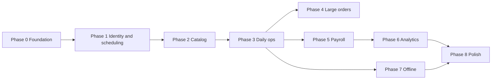

# Project plan — work breakdown

This plan divides work into **phases** with **deliverables** and **dependencies**. Order matters most for: **auth → catalog → daily operations → money → reporting → offline**.

---

## Phase 0 — Foundation

| Work package | Output |
|--------------|--------|
| Monorepo scaffold | Turborepo (or equivalent) with Next.js app, shared `packages/` for types/utils if needed |
| Repo standards | ESLint, Prettier, TypeScript strictness, env sample (no secrets) |
| Infrastructure sketch | Vercel project, Postgres provider (Neon / Supabase / RDS / other), migration tool (Prisma / Drizzle / Kysely) |
| **Definition of roles** | RBAC matrix in code + DB: cashier admin, secretary, stylist subtypes, clothier |

**Exit criteria:** App deploys to staging; DB connects; empty authenticated shell per role (placeholders).

---

## Phase 1 — Identity, employees, and scheduling basics

| Work package | Output |
|--------------|--------|
| Auth | Login, session, password reset flow (provider TBD: Auth.js, Clerk, etc.) |
| Employee profiles | Link user ↔ employee type (stylist subtype, clothier, secretary), active flag |
| Vacation / absence | Calendar model: vacation, optional other reasons; “expected at work” query for a date |
| Minimal secretary UI | View own calendar; stub for appointments (full booking in Phase 3) |

**Exit criteria:** Admin can create users/employees; system knows who is unavailable on a day.

---

## Phase 2 — Catalog and pricing (cashier admin)

| Work package | Output |
|--------------|--------|
| Stylist services | Service catalog, variants (e.g. length), customer price, **commission inputs** (% or fixed per variant—decide one rule set) |
| Cloth pieces | Piece types with **unit pay** to clothier and sale price as needed |
| Permissions | Only cashier/admin edits catalog |

**Exit criteria:** All service and piece types needed for MVP are CRUD-able with audit (who changed what).

---

## Phase 3 — Daily operations: jobs, cashier, cloth batches

| Work package | Output |
|--------------|--------|
| Stylist job logging | Stylist records a completed service; appears in cashier queue as billable |
| Ticket / checkout | Line items, subtotal, record payment **cash | card | transfer**, close job |
| Cloth batches | Secretary creates batch, assigns whole batch or per-piece to clothiers; clothiers mark pieces done |
| Appointments | Book: client name, service summary, stylist; list/filter by day |
| Appointment confirmation | Integrate one channel in MVP (e.g. email) or manual “confirmed” flag if integrations slip |

**Exit criteria:** End-to-end day: service logged → charged → closed; cloth batch assignable and trackable.

---

## Phase 4 — Large cloth orders (B2B-style)

| Work package | Output |
|--------------|--------|
| Order entity | Client, description, pricing, assignees, status |
| Payments on order | Upfront payment, balance owed, payment history |

**Exit criteria:** A large order can be tracked from deposit through delivery without using spreadsheets.

---

## Phase 5 — Payroll settlement and audit

| Work package | Output |
|--------------|--------|
| Earnings computation | From closed jobs + piece work: stylist commission, clothier piece totals |
| Payout records | Record amount, date, employee, period covered; prevent “paid twice” for same period (rules) |
| Admin review | Screen: filter by employee and day; mark settlement |

**Exit criteria:** Company can pay same night or next day with a clear paper trail.

---

## Phase 6 — Analytics

| Work package | Output |
|--------------|--------|
| Dashboards | Revenue day / week / month; jobs count per employee; earnings per employee for those periods |
| Exports (optional MVP+) | CSV for accountant |

**Exit criteria:** Leadership answers “how did we do?” and “who earned what?” without manual aggregation.

---

## Phase 7 — Offline / sync (hardening)

| Work package | Output |
|--------------|--------|
| Product rules | Document which actions are offline vs online-only (especially checkout) |
| Local queue | IndexedDB queue + sync status UI |
| Idempotent API | Idempotency keys for mutating routes; Postgres-backed as needed |
| PWA | Manifest, service worker strategy, install prompt where appropriate |

**Exit criteria:** Typical flaky-network day does not lose stylist logs; no duplicate charges under retry.

---

## Phase 8 — Polish and rollout

| Work package | Output |
|--------------|--------|
| Responsive QA | Phones + desktop for each role |
| Performance | Indexes for report queries; loading states |
| Training | Short internal doc or in-app help |
| Production cutover | Backups, monitoring, error tracking (e.g. Sentry) |

---

## Dependency graph (simplified)

*(Analytics can start after Phase 5; offline can overlap Phase 3–5 if staffed, but **idempotent APIs** should land before trusting offline replay.)*

---

## Suggested first vertical slice (MVP cut)

Minimum to replace spreadsheets for **one location**:

1. Auth + roles  
2. Small stylist catalog + stylist logs job  
3. Cashier sees open items, charges, payment method, closes  
4. Daily list of work per employee  
5. Simple daily revenue total  

Add secretary, cloth batches, large orders, full payroll UI, and analytics in subsequent iterations.

---

## Open decisions (track as issues)

- Commission rule: **% only**, **fixed per variant**, or **both**?  
- Taxes and invoices: in-scope for MVP or not?  
- Single location vs multi-branch (affects everything).  
- Notification provider for appointment confirmation.
