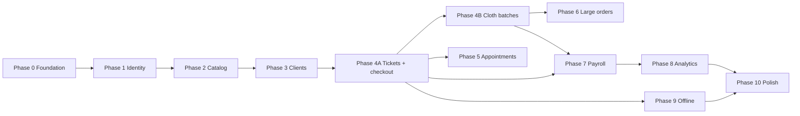

# Project plan — work breakdown

This plan divides work into **phases** with **deliverables** and **dependencies**. Order matters most for: **auth → catalog → daily operations → money → reporting → offline**.

> **Restructured after Senior Product Owner review (April 2026).** See `docs/research/senior_product_owner.md` for all findings and rationale. Summary of changes: T077 moved to Phase 0; T054 moved to Phase 1; Phase 4 split into 4A and 4B; T020/T021/T022b moved to Phase 7; T090/T091/T092/T093 added; T043 retired. Total tasks: 89 → 94.
>
> **Updated after Senior Software Engineer review (April 2026).** See `docs/research/senior_software_engineer.md` for all 25 findings. All accepted. New tasks: T094 (testing), T095 (CI/CD), T097 (API conventions), T098 (realtime abstraction), T099 (i18n), T100 (data migration), T101 (analytics seed), T102 (stale-tab detection), T032b (no-show logic). T085 moved Phase 10 → Phase 0. Multiple existing tasks received additional ACs (T002, T005, T006, T018, T025, T045, T049, T083). Dependency graph corrected. Total tasks: 94 → 103.
>
> **Updated after Senior Designer review (April 2026).** See `docs/research/senior_designer.md` for all 26 findings. All accepted. New tasks: T103 (design system and tokens), T104 (key screen wireframes), T105 (brand identity). Multiple existing tasks received additional UX/design ACs (T002, T014, T021, T024, T027, T030, T035, T036, T038, T046, T048, T050, T052, T062, T069, T070, T072, T073, T074, T082, T083, T084, T088, T090, T092, T093, T099). Recharts and Lucide Icons added to tech stack. Total tasks: 103 → 106.

---

## Phase 0 — Foundation

| Work package | Output |
|--------------|--------|
| Monorepo scaffold | Turborepo with Next.js app, shared `packages/` for types and utils |
| Repo standards | ESLint, Prettier, TypeScript strict mode, Zod validation policy, env sample, **money format (integer cents)** |
| Infrastructure | Vercel project, Neon Postgres (dev + staging branches), Drizzle ORM |
| Auth spike | Better Auth with RBAC plugin + rate limiting confirmed |
| Real-time spike | Pusher free tier confirmed on Vercel preview |
| **Real-time abstraction** | Thin wrapper around Pusher (`packages/realtime/`) for future migration to SSE |
| RBAC matrix | Roles in DB + code: cashier/admin, secretary, stylist (with subtype), clothier |
| **Offline policy** | `docs/research/offline-policy.md` signed off by stakeholder — before Phase 4A APIs are built |
| **Testing infrastructure** | Vitest + Playwright configured; testing policy documented |
| **CI/CD pipeline** | GitHub Actions: lint, typecheck, test on every PR; merge blocked on failure |
| **API conventions** | `docs/standards-api.md`: Server Actions vs REST, error shapes, pagination, Zod format |
| **i18n setup** | `next-intl` configured for Spanish (primary) + English; currency formatting utility |
| **Error tracking** | Sentry configured from day one (moved from Phase 10) |
| **Design system** | Design tokens (colours, typography, spacing, shadows), status colour palette, component patterns (empty states, confirmation dialogs, loading skeletons, search/filter, tables, badges), icon library (Lucide) |
| **Key screen wireframes** | Low-fidelity wireframes for 7 critical screens (cashier dashboard, checkout, admin home, login, appointment calendar, payroll, analytics) |

**Exit criteria:** App deploys to staging; DB connects; offline policy agreed; CI pipeline green; empty authenticated shell per role; i18n and error tracking active; design system documented and tokens configured.

---

## Phase 1 — Identity, employees, and business day

| Work package | Output |
|--------------|--------|
| **Resend setup** | Email transport configured; used by password reset and later by appointments |
| Auth | Login, session, password reset (via Resend); only admin creates accounts |
| Employee profiles | Link user ↔ role; stylist subtype; daily rate for secretary; active flag |
| Employee visibility flag | Admin toggle: show/hide own earnings per employee |
| **App navigation shell** | Role-aware sidebar/bottom nav; persistent layout for all subsequent screens |
| **Brand identity** | Logo/wordmark, brand colours applied to design tokens, favicon, PWA icons |
| **Self-service password change** | Authenticated employee changes own password |
| Business day open / close | Admin button; records stamped with business day ID, not calendar date |
| Basic employee deactivation | Disable login, preserve history (T022a) — earnings guard added in Phase 7 |

**Exit criteria:** Admin can open/close the day; create employees; navigation shell works for all roles; brand identity applied. Vacation/absence and deactivation guard deferred to Phase 7.

---

## Phase 2 — Catalog and pricing

| Work package | Output |
|--------------|--------|
| Service catalog | Service name, variants (e.g. hair length), customer price, commission % per variant |
| Cloth piece catalog | Piece type, customer sale price, clothier unit pay |
| Permissions | Only cashier/admin can create/edit catalog entries; full audit log (who changed what, when) |

**Exit criteria:** All service and piece types are CRUD-able with an audit trail; commission % is stored per service variant.

---

## Phase 3 — Client records

| Work package | Output |
|--------------|--------|
| Saved client | Name, ID, contact info (phone/email), full history, no-show count |
| Guest | Name-string only; no persistent record |
| Client search | Cashier/secretary can search saved clients by name or contact info at ticket/appointment creation |

**Exit criteria:** A saved client can be searched and linked to a ticket or appointment; guest flow skips all of this.

---

## Phase 4A — Tickets and checkout

| Work package | Output |
|--------------|--------|
| Ticket creation | Stylist, secretary, or cashier creates ticket; walk-in and appointment-linked both supported |
| `idempotency_key` on tickets table | Designed in from the start per offline policy (T077) |
| Ticket lifecycle | `logged → awaiting payment → closed`; reopened by cashier only; optimistic lock on checkout |
| Cashier dashboard | Real-time view of all open tickets grouped by employee; live updates via `packages/realtime` abstraction |
| Checkout | Line items, split payment, price override; optimistic lock prevents concurrent double-close |
| Edit approval flow | Stylist or secretary submits edit request → cashier approves or rejects |
| In-app notifications | Bell icon + real-time delivery via abstraction; used by edit approval flow first |
| **Ticket history view** | Admin/cashier sees all closed tickets for any business day; search by client name |
| **Admin home screen** | Live day status, open ticket count, revenue so far, quick links |

**Exit criteria:** Full service-to-payment loop works end to end; cashier dashboard updates live; admin has operational day view.

---

## Phase 4B — Cloth batches

> Can run in parallel with Phase 5 once Phase 4A is done.

| Work package | Output |
|--------------|--------|
| Cloth batches | Secretary/admin creates batch; assigns pieces to clothier(s) per-piece or whole-batch |
| Piece completion | Clothier marks done → secretary/admin approves (or admin marks done directly) |
| Notifications | Clothier notified on assignment; secretary notified on piece completion |

**Exit criteria:** Secretary can create and assign batches; clothier can mark pieces done; approvals tracked.

---

## Phase 5 — Appointments

| Work package | Output |
|--------------|--------|
| Appointment booking | Client (saved or guest), service summary, stylist, date + time |
| Double-booking prevention | System rejects overlapping time slots for the same stylist |
| Appointment states | `booked → confirmed → completed / cancelled / rescheduled / no-show` |
| No-show tracking | Recorded against saved client profile; guest no-shows not tracked |
| Confirmation email | Confirmation email via Resend (T055 + T056); WhatsApp deferred to post-MVP |

**Exit criteria:** Secretary can book, confirm, and manage appointments; double-booking is blocked.

---

## Phase 6 — Large cloth orders

| Work package | Output |
|--------------|--------|
| Order record | Client (saved), description, total price, deposit paid, balance owed, assigned clothier(s), status |
| Order → batch link | Batches created under a large order; order status derived from batch progress |
| Order status flow | `pending → in production → ready → delivered → paid in full` (secretary/admin updates) |
| ETA visibility | Cashier/admin can see order progress to communicate ETA to client |

**Exit criteria:** A large client order can be tracked from deposit through full payment without spreadsheets.

---

## Phase 7 — Payroll settlement and audit

| Work package | Output |
|--------------|--------|
| **Absence / vacation tracking** | Table + admin calendar UI (T020, T021) — moved here from Phase 1; consumed by secretary earnings |
| **Deactivation guard + termination** | Block deactivation if unsettled pay; termination payment shortcut (T022b) |
| Earnings computation | Stylist: commissions; clothier: approved pieces; secretary: daily rate × days worked |
| Payout records | Amount, date, period, payment method; per employee |
| Prevent double-pay | Block settling the same period twice per employee |
| Admin review screen | Filter by employee and date range; mark settled |
| Unsettled flag | Surface any employee with open unpaid earnings |

**Exit criteria:** Admin can pay any employee with a full audit trail; vacation calendar live; deactivation guard active.

---

## Phase 8 — Analytics

| Work package | Output |
|--------------|--------|
| Revenue dashboard | Day / week / month totals + comparison to prior equivalent period; Recharts visualizations |
| Employee performance | Jobs count per employee; earnings per employee; both with period comparison; sortable table with inline indicators |
| Indexes and query opt. | Ensure report queries stay fast on realistic data volumes |
| **Analytics seed script** | 6 months of realistic test data for verifying query correctness and performance |
| CSV export (stretch) | Export for accountant |

**Exit criteria:** Admin can answer "how did we do vs last week?" and "who earned what this month?" without manual work.

---

## Phase 9 — Offline / sync hardening

> The offline policy (T077) was decided in Phase 0. The `idempotency_key` column on tickets was added in Phase 4A (T033). This phase implements the client-side queue and service worker on top of those foundations.

| Work package | Output |
|--------------|--------|
| Idempotency on remaining routes | Apply idempotency key pattern to piece mark-done and any other offline-capable mutations |
| IndexedDB local queue | Queue ticket creation and piece-done mutations locally with stable client-generated UUIDs |
| Sync status UI | Indicator: synced / syncing / offline / failed with retry |
| PWA | Web App Manifest, service worker (Workbox caching), install prompt |

**Exit criteria:** Stylist logs are not lost on flaky connections; no duplicate tickets or double charges after reconnect.

---

## Phase 10 — Polish and rollout

| Work package | Output |
|--------------|--------|
| Responsive + a11y QA | Test all role flows on phones and desktop; verify WCAG AA compliance; dark mode stretch; gesture support stretch |
| Performance pass | Loading states, optimistic UI, slow-connection testing |
| **Stale-tab detection** | "Please refresh" banner when a new version is deployed |
| **Data migration** | Import existing client records from spreadsheets |
| Backups and monitoring | DB backup policy; uptime monitoring on Vercel |
| Training material | Short internal guide (one page per role) |

---

## Dependency graph

> 4B and 5 can run in parallel after 4A. Phase 6 depends on 4B (batches link to large orders) but not on Phase 5. Phase 5 → Phase 6 edge removed after Senior SWE review (no Phase 6 task depends on appointments). Phase 7 depends on both 4A (ticket earnings) and 4B (clothier earnings from approved batch pieces).

---

## Suggested MVP vertical slice (minimum to replace spreadsheets)

1. Auth + roles + business day open/close
2. Service catalog with commissions + cloth piece catalog
3. Saved clients + guest flow
4. Ticket creation → awaiting payment → cashier closes → payment method recorded
5. Live cashier dashboard
6. Daily earnings list per employee (stylist commissions + clothier piece totals)
7. Simple daily revenue total

Everything else (appointments, large orders, full payroll UI, analytics, offline) is added in subsequent iterations.

---

## Resolved decisions

| Decision | Answer |
|----------|--------|
| Commission rule | Per-service commission %; same rate for all stylists on that service |
| Secretary pay | Fixed daily amount set by admin |
| Client model | Saved (full profile) or guest (name only); guest has no history |
| Ticket scope | One ticket per service per stylist; one customer can have multiple tickets |
| Cloth batches and large orders | Linked; batches can also exist independently |
| Payment splitting | Allowed; rare in practice |
| Price override | Cashier only; reason stored in DB; hidden from frontend |
| Business day | Open/close button; records belong to business day ID |
| Tips | Not tracked; out of scope |
| Employee earnings visibility | Visible to employee by default; admin can revoke per employee |
| One role per employee | Yes; no dual roles |
| Secretary and financials | No access to revenue, pay, or settlements |
| Appointment time slots | Specific time; double-booking blocked |
| No-show tracking | Against saved clients only |
| Piece completion approval | Clothier marks done → secretary/admin approves |
| Large order statuses | `pending → in production → ready → delivered → paid in full` |
| Refunds / reopen | Cashier only; earnings recomputed |
| Payout method | Amount + payment method recorded |
| Employee deactivation | Deactivated (history kept); termination payment shortcut |
| Analytics comparison | Totals + comparison to prior period |
| Real-time dashboard | Live via `packages/realtime` abstraction (Pusher for MVP; SSE + Postgres LISTEN/NOTIFY later) |
| In-app notifications | Yes for clothier (batch assignment) and stylist (new appointment) |
| Promotions / discounts | Out of scope for now |
| Multi-branch | Out of scope for now |
| Money storage format | Integer cents (`bigint`); display layer converts. No `numeric` or `float`. |
| UI language | Bilingual: Spanish (primary) + English. i18n via `next-intl`. |
| Business day uniqueness | DB constraint (partial unique index) — not app-level guard only |
| Error tracking timing | Phase 0 (Sentry configured from day one) |
| Testing strategy | Vitest for unit/integration; Playwright for E2E; policy: unit tests required for business logic |
| CI/CD | GitHub Actions on every PR; merge blocked on failure |
| UI component library | Base Web (primary); **shadcn/ui + Tailwind CSS** as fallback if spike fails |
| Forms | React Hook Form + Zod resolver; shared schemas between client and server |
| Server state | TanStack Query for caching and revalidation |
| Client state | Zustand for ephemeral UI state (offline queue, notifications) |
| Date library | date-fns for all date manipulation and formatting |
| PWA wrapper | Evaluate `@ducanh2912/next-pwa` or custom Workbox (not original `next-pwa`) |
| Design system | Design tokens defined in Phase 0; covers colours, typography, spacing, shadows, status palette |
| Icon library | **Lucide Icons** — default with shadcn/ui; consistent style across all UI |
| Charts library | **Recharts** — React-native, composable, good mobile support |
| Status colours | Unified semantic colour palette: grey (initial), blue (in-progress), amber (needs attention), green (completed), red (negative) |
| Mobile-first roles | Clothier and stylist screens designed mobile-first; desktop is the secondary adaptation |
| Form UX | Stacked labels; validate on blur + submit; inline errors; required by default; "(optional)" suffix on exceptions |
| Loading pattern | Skeleton screens for page loads; spinner for buttons; applied from Phase 1, not retrofitted in Phase 10 |
| Empty states | All list/dashboard screens must have a designed empty state with message and optional CTA |
| Confirmation dialogs | Standard (Cancel + Confirm) for reversible actions; destructive variant (red, prominent warning) for financial/permanent actions |
| Receipts | Post-checkout confirmation screen with optional print; added to T038 |
| Brand identity | Logo, brand colours, favicon, PWA icons gathered or created in Phase 1 (T105) |
| Dark mode | Design tokens built dark-mode-aware; dark mode implementation is a Phase 10 stretch goal |

---

## Remaining open questions

- **UI library**: T008 spike will determine Base Web vs shadcn/ui. If Base Web requires `"use client"` on >50% of usage sites or has hydration issues, switch to shadcn/ui + Tailwind CSS.
- **Currency**: Confirm the currency used by the business (COP, USD, or other) — needed for i18n setup (T099).
- **Brand assets**: Does Innovation Befine have an existing logo and brand colours? Needed for T105 (brand identity).

## Researched and recommended (see `docs/research/`)

| Decision | Recommendation | Research file |
|----------|---------------|---------------|
| Postgres provider | **Neon** — Vercel-native, usage-based, free in dev | [postgres-providers.md](./research/postgres-providers.md) |
| Auth provider | **Better Auth** — free, built-in RBAC, self-hosted | [auth-providers.md](./research/auth-providers.md) |
| Real-time transport | **Pusher free tier** for MVP; native SSE + Postgres LISTEN/NOTIFY later | [realtime-transport.md](./research/realtime-transport.md) |
| Appointment confirmation | **Email via Resend** for MVP; WhatsApp post-MVP | [notification-channels.md](./research/notification-channels.md) |
