# Manual de Usuario — Innovation Befine

> **Versión:** Post-lanzamiento · **Idioma:** Español (primario)  
> Cubre todas las pantallas del sistema agrupadas por rol.  
> Los roles son: **Admin**, **Cajero**, **Secretaria**, **Estilista**, **Confeccionista**.
>
> **Capturas de pantalla:** Las imágenes se generan con el script Playwright en `apps/web/e2e/screenshots.ts`.  
> Para regenerarlas: inicia el servidor (`pnpm dev`) y ejecuta:  
> `PLAYWRIGHT_BASE_URL=http://localhost:3000 pnpm --filter @befine/web test:e2e --project=chromium e2e/screenshots.ts`

---

## Tabla de contenidos

1. [Elementos comunes](#1-elementos-comunes)
2. [Admin](#2-admin)
3. [Cajero](#3-cajero)
4. [Secretaria](#4-secretaria)
5. [Estilista](#5-estilista)
6. [Confeccionista](#6-confeccionista)
7. [Referencia rápida de accesos por rol](#7-referencia-rápida-de-accesos-por-rol)

---

## 1. Elementos comunes

Estas pantallas y controles están disponibles para **todos los roles**.

### 1.1 Barra lateral / Barra inferior de navegación

Los roles **Admin**, **Cajero** y **Secretaria** ven una barra lateral colapsable en el lado izquierdo de la pantalla. En modo colapsado solo muestra íconos; al expandir aparecen los nombres de las secciones.

Los roles **Estilista** y **Confeccionista** usan en su lugar una **barra de navegación inferior** fija, optimizada para uso en teléfono móvil.

| Control                   | Qué hace                                     |
| ------------------------- | -------------------------------------------- |
| Ícono `≡` (hamburguesa)   | Expande o colapsa la barra lateral (desktop) |
| Clic en ícono del perfil  | Abre el menú de usuario                      |
| Campana de notificaciones | Muestra las notificaciones no leídas         |

### 1.2 Menú de usuario

Accesible desde el ícono de avatar en cualquier pantalla.

| Opción        | Descripción                                                                    |
| ------------- | ------------------------------------------------------------------------------ |
| Nombre + rol  | Solo informativo. Muestra tu nombre y rol actual.                              |
| Perfil        | Abre la pantalla de cambio de contraseña.                                      |
| Tema          | Alterna entre modo claro y oscuro. La preferencia se guarda en el dispositivo. |
| Cerrar sesión | Cierra la sesión y redirige a `/login`.                                        |

### 1.3 Campana de notificaciones

Muestra alertas en tiempo real relevantes para tu rol:

- **Estilista / Secretaria:** cambios de precio en variantes de servicios ya agendados.
- **Admin / Cajero:** solicitudes de edición de tickets pendientes.

Al hacer clic en una notificación se navega directamente a la pantalla relacionada. Las notificaciones se marcan como leídas automáticamente al abrir el panel.

**Controles del panel:**

- `↑` / `↓` — navegar entre notificaciones con el teclado.
- `Escape` — cerrar el panel.
- **"Marcar todas como leídas"** — limpia el indicador de badge.

### 1.4 Banner de versión

Si hay una nueva versión de la aplicación disponible, aparece una barra de color al tope de la pantalla con el botón **"Actualizar"**. Al hacer clic se recarga la página con la versión actualizada. Se puede descartar con el botón `×`.

### 1.5 Pantalla de Perfil (`/profile`)

Disponible para **todos los roles** desde el menú de usuario.

**Qué muestra:**

- Formulario de cambio de contraseña.

**Acciones:**

1. Ingresa tu **contraseña actual**.
2. Ingresa la **nueva contraseña** (mínimo 8 caracteres).
3. Confirma la nueva contraseña.
4. Clic en **"Guardar"**.

> Si olvidaste tu contraseña actual, contacta al administrador del sistema.

---

## 2. Admin

El rol **Admin** tiene acceso completo al sistema. Puede operar la caja (todo lo que ve el Cajero) y además gestionar empleados, catálogo, nómina y analíticas.

Accede a través del prefijo `/admin` y `/cashier`.

---

### 2.1 Panel del cajero (`/cashier`)

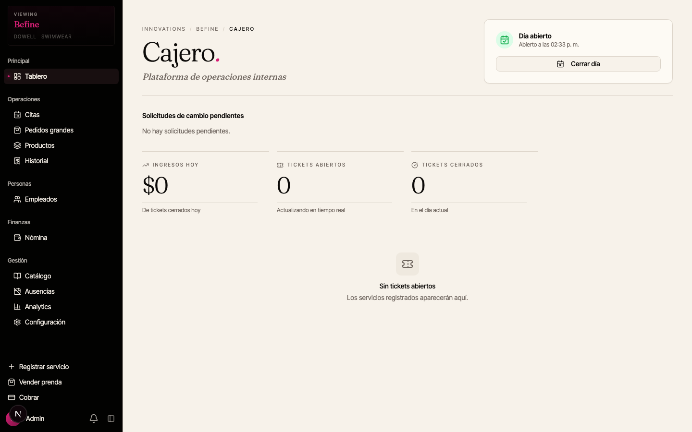

Pantalla de inicio del Admin y del Cajero. Es el centro de operaciones del día.

**Qué muestra:**

| Sección                           | Descripción                                                                     |
| --------------------------------- | ------------------------------------------------------------------------------- |
| Estado del día                    | Si el día está abierto, cerrado o sin abrir. Hora de apertura.                  |
| Tarjetas de estadísticas          | Ingresos del día, pagos registrados, tickets abiertos, tickets cerrados.        |
| Tablero de tickets                | Lista en tiempo real de todos los tickets activos del día.                      |
| Solicitudes de edición pendientes | Si hay solicitudes de corrección de tickets enviadas por estilistas/secretaria. |

**Acciones disponibles:**

| Acción                                             | Cuándo aparece                                                                          |
| -------------------------------------------------- | --------------------------------------------------------------------------------------- |
| **Abrir día**                                      | Solo cuando no hay un día abierto.                                                      |
| **Cerrar día**                                     | Solo cuando el día está abierto y no hay tickets pendientes de pago. Pide confirmación. |
| **Reabrir día**                                    | Solo cuando el día está cerrado (corrección de error).                                  |
| **Nuevo ticket** (menú lateral o botón en tablero) | Siempre que el día esté abierto.                                                        |
| **Cobrar** (menú lateral)                          | Abre el flujo de checkout.                                                              |

**Flujo típico del día:**

```
Abrir día → Registrar tickets → Marcar listos → Cobrar → Cerrar día
```

> **Vacío por la mañana:** Si aún no se abrió el día, en lugar de las estadísticas se muestra una pantalla de estado vacía con el botón "Abrir día" como acción principal.

---

### 2.2 Historial de tickets (`/cashier/tickets/history`)

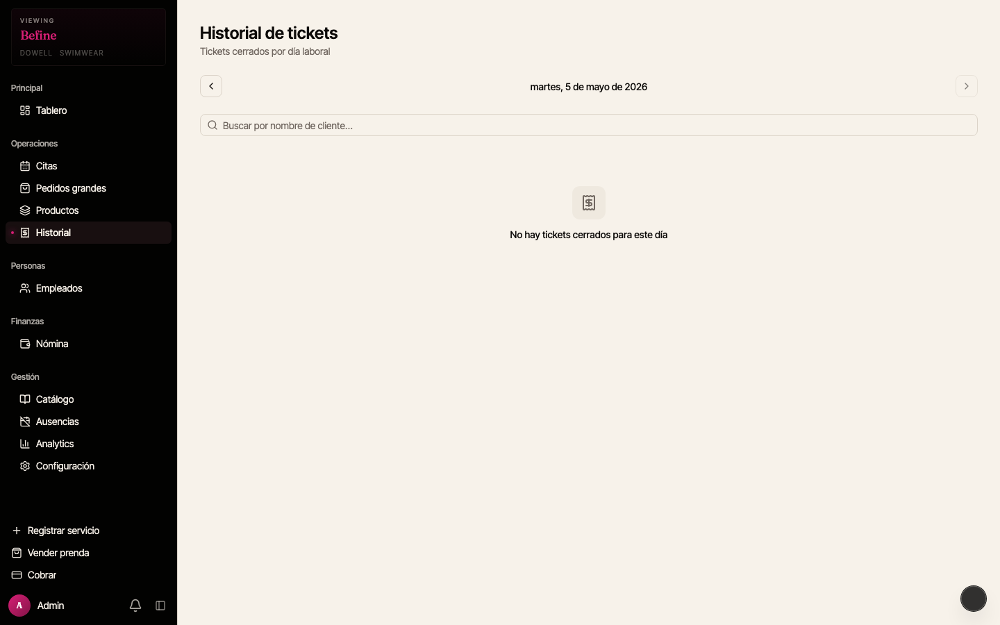

Vista de todos los tickets **cerrados** (cobrados), organizados por día laboral.

**Qué muestra:**

- Selector de día laboral (por defecto: el más reciente).
- Tabla de tickets cerrados: empleada, cliente, servicio, precio, hora de cobro.
- Total de ingresos del día seleccionado.

**Acciones disponibles:**

| Acción      | Descripción                                         |
| ----------- | --------------------------------------------------- |
| Cambiar día | Selecciona un día laboral anterior del desplegable. |
| Ver detalle | Clic en un ticket para ver su desglose completo.    |

> Este historial es de solo lectura. Los tickets cerrados no pueden modificarse.

---

### 2.3 Citas (`/cashier/appointments`)

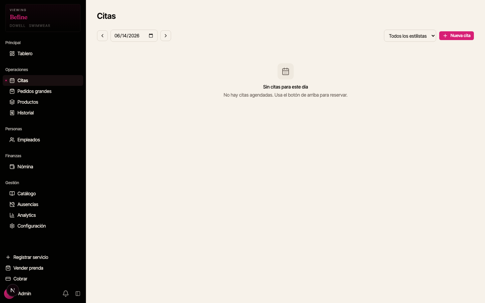

Calendario de citas del salón. Admin y Cajero ven todas las citas; la Secretaria las gestiona.

**Qué muestra:**

- Lista de citas del día actual con estado: Agendada, Confirmada, Completada, Cancelada, No show.
- Nombre de la clienta, servicio, estilista asignada, hora.

**Acciones disponibles (Admin):**

| Acción         | Descripción                                               |
| -------------- | --------------------------------------------------------- |
| **Nueva cita** | Abre el formulario de creación de cita.                   |
| **Confirmar**  | Cambia el estado de `Agendada` → `Confirmada`.            |
| **Completar**  | Cambia el estado a `Completada`.                          |
| **No show**    | Registra la inasistencia de la clienta.                   |
| **Cancelar**   | Cancela la cita. Requiere confirmación.                   |
| **Reagendar**  | Cambia la fecha y hora. El sistema valida disponibilidad. |

> **Alerta de precio:** Si el precio del servicio cambió desde que se creó la cita, aparece un badge amarillo. El admin o secretaria debe confirmar el nuevo precio antes de completarla.

---

### 2.4 Pedidos grandes (`/large-orders`)

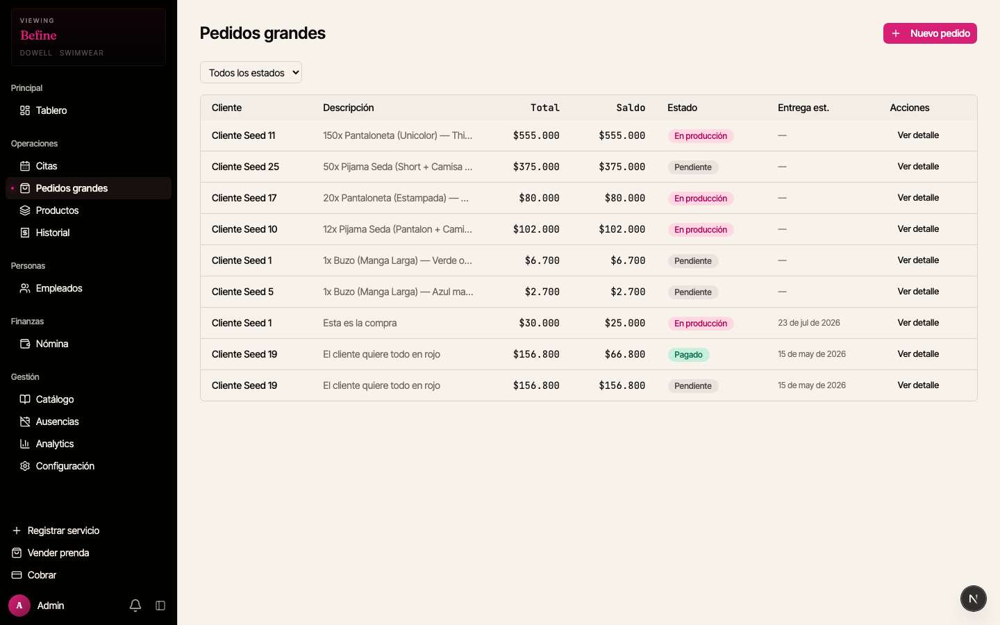

Gestión de pedidos de clientes que implican múltiples piezas de confección.

**Qué muestra:**

- Tabla de todos los pedidos grandes: cliente, descripción, estado, monto total, fecha.
- Estados: `Pendiente`, `En producción`, `Completado`, `Cancelado`.

**Acciones disponibles:**

| Acción              | Descripción                                                          |
| ------------------- | -------------------------------------------------------------------- |
| **Nuevo pedido**    | Abre el formulario de creación.                                      |
| **Ver detalle**     | Abre la vista completa del pedido con pagos y sección de producción. |
| **Cancelar pedido** | Solo si no hay piezas aprobadas. Requiere confirmación.              |

**Pantalla de detalle de un pedido (`/large-orders/[id]`):**

Tres secciones:

1. **Datos del pedido** — descripción, cliente, total acordado, fecha.
2. **Pagos** — registro de abonos del cliente. Botón "Registrar pago" para agregar un abono. Muestra saldo pendiente.
3. **Producción** — tabla `OrderItemProgressTable` con las piezas del pedido agrupadas por tipo:
   - Columnas: Empleada, Asignado, Completado, Aprobado, Progreso (%).
   - Fila "Sin asignar" cuando hay unidades sin asignar aún.
   - Botón **"Asignar"** por pieza (abre formulario: confeccionista + cantidad).
   - Botón **"Aprobar"** por asignación (establece cantidad aprobada).

---

### 2.5 Productos — confección (`/admin/products`)

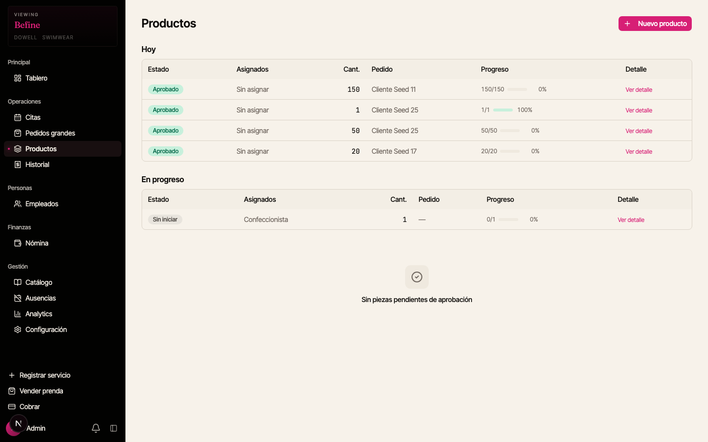

Gestión de los lotes de producción (confeccionables) creados por el negocio.

**Qué muestra:**

Dos secciones:

- **Hoy** — lotes creados en el día laboral actual.
- **En progreso** — lotes de días anteriores con al menos una pieza sin aprobar.

Cada fila muestra: estado (badge de color), empleadas asignadas, cantidad total, pedido grande vinculado, barra de progreso (`aprobadas / total`).

**Colores de estado:**

| Badge | Estado                  |
| ----- | ----------------------- |
| Gris  | Sin iniciar             |
| Azul  | En progreso             |
| Ámbar | Pendiente de aprobación |
| Verde | Todo aprobado           |

**Acciones disponibles:**

| Acción             | Descripción                               |
| ------------------ | ----------------------------------------- |
| **Nuevo producto** | Crea un nuevo lote de producción.         |
| **Ver detalle**    | Navega a la pantalla de detalle del lote. |

**Pantalla de detalle (`/admin/products/[id]`):**

- Lista de piezas con: nombre, cantidad (`×N`), notas por pieza (color, estilo, talla, instrucciones — expandibles).
- Botón **"Editar pieza"** (admin y secretaria): cambia cantidad y notas.
- Botón **"Aprobar"** (admin y secretaria): aprueba la pieza completada por la confeccionista.

> Si el lote fue creado por Admin, se marca como `auto_aprobado` — las piezas pasan directamente a Aprobado cuando la confeccionista las marca como hechas.

---

### 2.6 Empleados (`/admin/employees`)

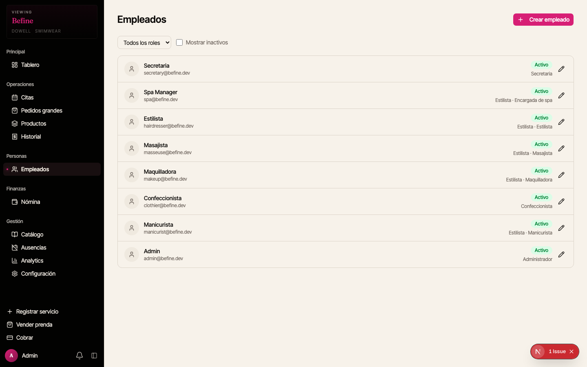

Directorio de todos los empleados registrados en el sistema.

**Qué muestra:**

- Tabla de empleados: nombre, rol, estado (Activo / Inactivo).
- Sección separada para empleados inactivos.

**Acciones disponibles:**

| Acción             | Descripción                                                                                                                      |
| ------------------ | -------------------------------------------------------------------------------------------------------------------------------- |
| **Nuevo empleado** | Abre formulario: nombre, rol, email (o nickname si está desactivado el requisito de email en Configuración), contraseña inicial. |
| **Editar**         | Modifica nombre o email del empleado.                                                                                            |
| **Desactivar**     | Marca al empleado como inactivo. Requiere confirmación. El empleado no puede iniciar sesión.                                     |
| **Reactivar**      | Vuelve a activar a un empleado inactivo.                                                                                         |

> Los empleados desactivados no se eliminan del historial — los tickets, pagos y liquidaciones históricas quedan intactos.

**Roles disponibles para asignar:** `admin`, `cajero`, `secretaria`, `estilista`, `confeccionista`.

---

### 2.7 Catálogo (`/admin/catalog`)

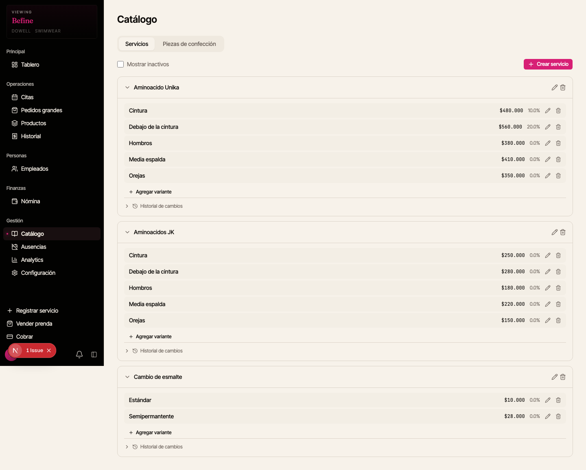

Gestión de los servicios ofrecidos y las piezas de tela disponibles. Dos pestañas:

#### Pestaña: Servicios

- Lista de todos los servicios activos e inactivos.
- Cada servicio tiene una o más **variantes de precio** (p. ej. "Tinte completo – $80.000", "Mechas – $120.000").

**Acciones en servicios:**

| Acción                  | Descripción                                                                                                                            |
| ----------------------- | -------------------------------------------------------------------------------------------------------------------------------------- |
| **Nuevo servicio**      | Crea un servicio con nombre y primera variante.                                                                                        |
| **Editar servicio**     | Cambia el nombre.                                                                                                                      |
| **Desactivar servicio** | El servicio deja de aparecer para tickets nuevos. Si hay tickets abiertos referenciando el servicio, aparece una advertencia en ámbar. |

**Acciones en variantes (acordeón):**

| Acción                  | Descripción                                                                                                                         |
| ----------------------- | ----------------------------------------------------------------------------------------------------------------------------------- |
| **Expandir variante**   | Abre el editor de la variante (solo una a la vez). Si hay cambios sin guardar, pide confirmación antes de cerrar.                   |
| **Editar precio**       | Al cambiar el precio de una variante, el sistema notifica automáticamente a las estilistas con citas futuras que usan esa variante. |
| **Desactivar variante** | La variante deja de estar disponible. Si tiene tickets abiertos, muestra advertencia.                                               |
| **Nueva variante**      | Agrega una variante adicional al servicio.                                                                                          |

#### Pestaña: Piezas de tela

- Lista de piezas de tela disponibles para ventas y pedidos grandes.

**Acciones:**

| Acción          | Descripción                                            |
| --------------- | ------------------------------------------------------ |
| **Nueva pieza** | Crea una pieza con nombre, SKU y precio unitario.      |
| **Editar**      | Cambia nombre, SKU o precio.                           |
| **Desactivar**  | La pieza deja de estar disponible para nuevos pedidos. |

---

### 2.8 Ausencias (`/admin/absences`)

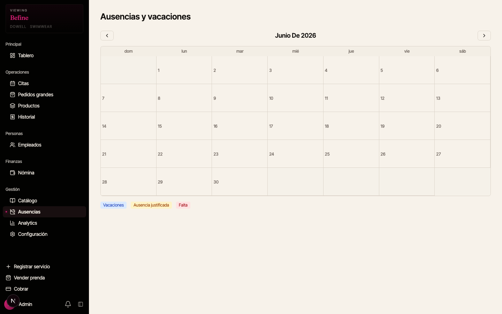

Registro de ausencias y vacaciones de empleados.

**Qué muestra:**

- Calendario mensual con las ausencias marcadas por empleada.
- Tipos de ausencia: `Vacaciones`, `Ausencia aprobada`, `Ausencia no aprobada`, `Día libre`.
- Selector de mes/año para navegar el historial.

**Acciones disponibles:**

| Acción                 | Descripción                                                          |
| ---------------------- | -------------------------------------------------------------------- |
| **Registrar ausencia** | Selecciona empleada, fecha(s), tipo de ausencia y motivo (opcional). |
| **Eliminar ausencia**  | Clic en el marcador de una ausencia → botón de eliminar.             |

> Las ausencias afectan el cálculo de la nómina de secretarias (que cobran por día trabajado).

---

### 2.9 Nómina (`/admin/payroll`)

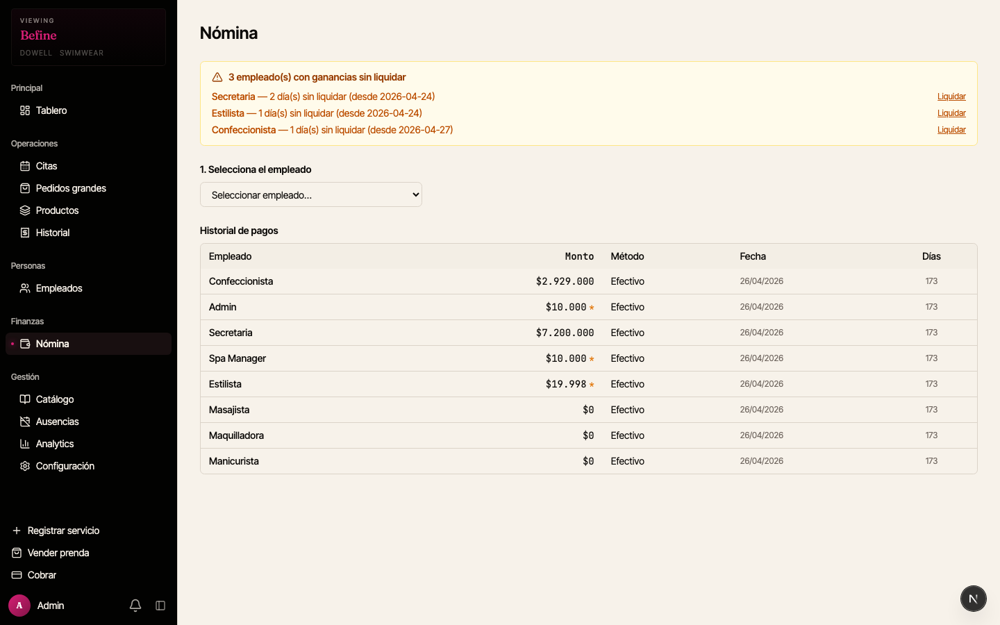

Liquidación de pagos a empleados.

**Qué muestra:**

- **Alerta de pagos pendientes** (parte superior): lista de empleados con días laborales cerrados sin liquidar.
- **Selector de empleada** — al elegir una empleada:
  - Lista de días laborales cerrados disponibles para liquidar.
  - **Grilla de estado de pagos** (últimos 14 días): verde = pagado, ámbar = pendiente, gris = día no cerrado.
  - Historial de pagos registrados para esa empleada.

**Acciones disponibles:**

| Acción                 | Descripción                                                                                                   |
| ---------------------- | ------------------------------------------------------------------------------------------------------------- |
| **Pagar hoy**          | Atajo que pre-selecciona automáticamente el día laboral actual.                                               |
| **Seleccionar días**   | Marca uno o varios días para liquidar en conjunto.                                                            |
| **Registrar pago**     | Calcula automáticamente el monto según el rol de la empleada (ver abajo). Pide método de pago y confirmación. |
| **Ajuste excepcional** | Campo opcional para agregar o deducir un monto adicional con motivo escrito.                                  |

**Cálculo automático por rol:**

| Rol            | Método de cálculo                                                                 |
| -------------- | --------------------------------------------------------------------------------- |
| Estilista      | Suma de (precio del ticket × % de comisión) de los tickets cerrados en esos días. |
| Confeccionista | Suma de (tarifa por pieza × piezas aprobadas) en esos días.                       |
| Secretaria     | Días trabajados × tarifa diaria (descontando ausencias tipo vacaciones/aprobada). |

> **Regla de orden:** No se puede liquidar el día actual si hay días laborales anteriores cerrados sin liquidar para esa empleada. El sistema devuelve un error `CONFLICT` con la lista de días pendientes.

---

### 2.10 Analíticas (`/admin/analytics`)

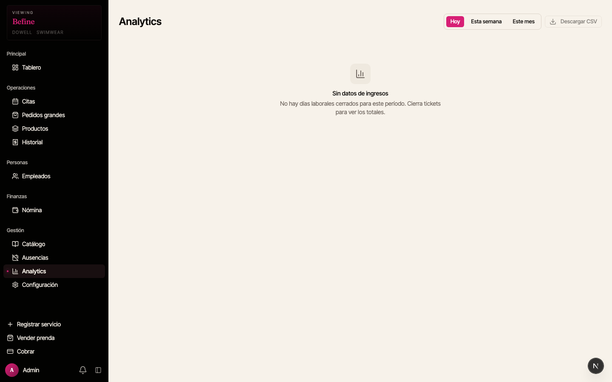

Reportes de rendimiento del negocio.

**Qué muestra:**

Tres pestañas de período:

| Pestaña | Período                                        |
| ------- | ---------------------------------------------- |
| Hoy     | Día laboral actual (incluido si está abierto). |
| Semana  | Semana calendario actual (lunes–domingo).      |
| Mes     | Mes calendario actual.                         |

En cada pestaña:

- **Tarjetas de resumen:** Ingresos totales, ingresos por servicios, ingresos por ventas de prenda, empleos realizados, ganancias totales de empleados. Con variación vs. período anterior (↑ verde / ↓ rojo).
- **Gráfico de ingresos diarios** (barras — Recharts).
- **Tabla de empleados:** nombre, rol, trabajos realizados, ganancias. Sorteable por nombre, empleos o ganancias. Enlace a detalle por empleada.
- **Toggle "Incluir inactivos":** muestra empleadas que ya no están activas.

**Acciones disponibles:**

| Acción              | Descripción                                                                                                                                             |
| ------------------- | ------------------------------------------------------------------------------------------------------------------------------------------------------- |
| **Exportar CSV**    | Descarga un archivo con columnas: fecha, empleada, rol, empleos, ganancias, ingresos del día. Deshabilitado si no hay datos.                            |
| **Cambiar período** | Clic en las pestañas Hoy / Semana / Mes. El dashboard se actualiza en tiempo real (al cerrar un ticket nuevo el dashboard se refresca automáticamente). |

**Drill-down por empleada:**

Al hacer clic en el nombre de una empleada en la tabla, aparece el detalle:

- Desglose por día laboral: fecha, trabajos, ganancias.
- Sorteable por fecha o ganancias.

---

### 2.11 Configuración (`/admin/settings`)

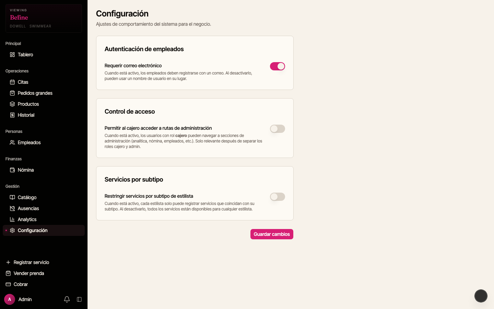

Ajustes de comportamiento del sistema. Solo visible para el rol **Admin**.

**Opciones disponibles:**

| Toggle                                             | Descripción                                                                                                                                                |
| -------------------------------------------------- | ---------------------------------------------------------------------------------------------------------------------------------------------------------- |
| **Los empleados requieren email para registrarse** | Si está activo (por defecto), el formulario de nuevo empleado exige email. Si se desactiva, acepta un nombre de usuario/apodo en su lugar.                 |
| **El cajero puede acceder a rutas `/admin`**       | Si se activa, un usuario con rol `cajero` puede navegar a pantallas de administración como analíticas, empleados y catálogo. Por defecto está desactivado. |

Cambiar cualquier opción toma efecto inmediatamente, sin reiniciar el servidor.

---

### 2.12 Hoja de ruta interna (`/admin/roadmap`)

Pantalla interna para el equipo de desarrollo. Muestra el estado de las fases de estabilización del producto: tareas completadas, en progreso y pendientes con porcentaje de avance general.

> Esta pantalla no es parte de las operaciones del día a día; es solo para seguimiento interno.

---

## 3. Cajero

El rol **Cajero** tiene acceso a las operaciones de caja (POS). Ve las mismas pantallas que el Admin en el área de caja, pero **no tiene acceso** a empleados, catálogo, ausencias, nómina, analíticas ni configuración.

**Pantallas disponibles:**

| Pantalla             | URL                        | Descripción          |
| -------------------- | -------------------------- | -------------------- |
| Panel del cajero     | `/cashier`                 | Igual que Admin §2.1 |
| Historial de tickets | `/cashier/tickets/history` | Igual que Admin §2.2 |
| Citas                | `/cashier/appointments`    | Igual que Admin §2.3 |
| Pedidos grandes      | `/large-orders`            | Igual que Admin §2.4 |
| Perfil               | `/profile`                 | Cambio de contraseña |

> Si el Admin activa "El cajero puede acceder a rutas `/admin`" en Configuración, el Cajero también puede ver Analíticas, Catálogo y Empleados. Por defecto esta opción está desactivada.

---

## 4. Secretaria

La Secretaria gestiona citas, pedidos y producción. No tiene acceso a caja (cobros, apertura/cierre de día) ni a reportes financieros.

---

### 4.1 Panel de la secretaria (`/secretary`)

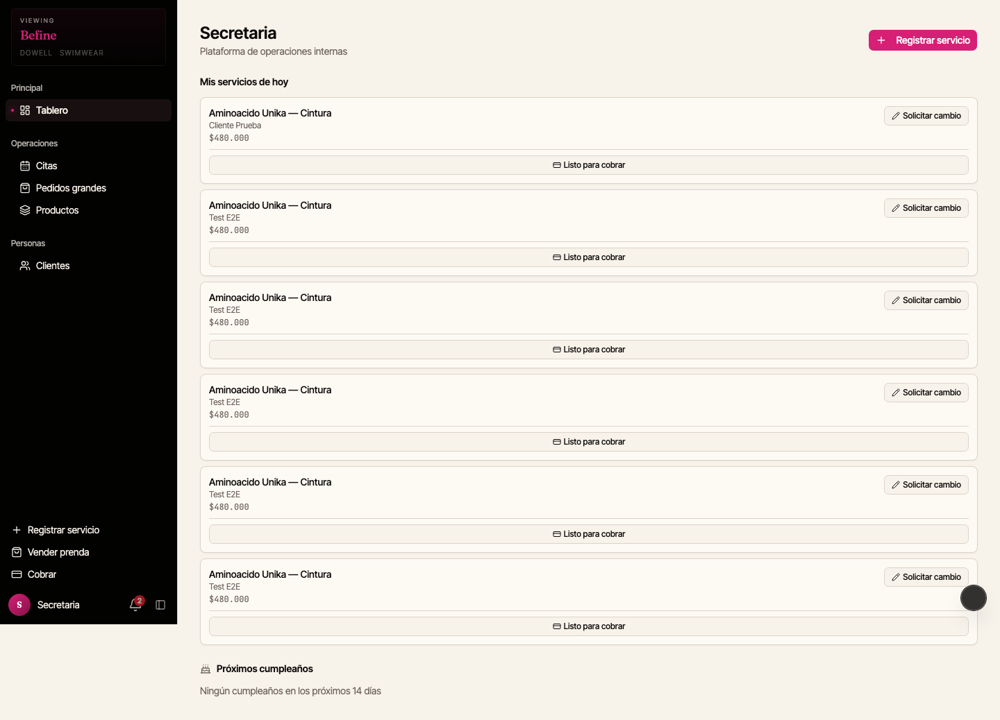

Pantalla de inicio de la Secretaria.

**Qué muestra:**

- Acceso rápido a las secciones principales.
- Mis tickets abiertos y solicitudes de edición pendientes (si la Secretaria también registra servicios).
- Botón **"Nuevo ticket"** para registrar un servicio.

---

### 4.2 Pedidos grandes (`/large-orders`)

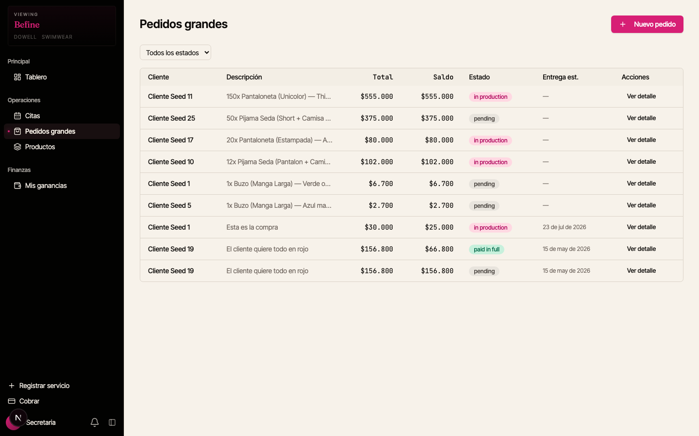

Misma pantalla que Admin §2.4. La Secretaria puede:

- Ver todos los pedidos grandes.
- Crear pedidos nuevos.
- Registrar abonos.
- Asignar piezas a confeccionistas en la sección de Producción.
- Aprobar cantidades completadas.

> La Secretaria **no puede** cobrar el total del pedido (eso corresponde al Admin/Cajero).

---

### 4.3 Productos — confección (`/secretary/products`)

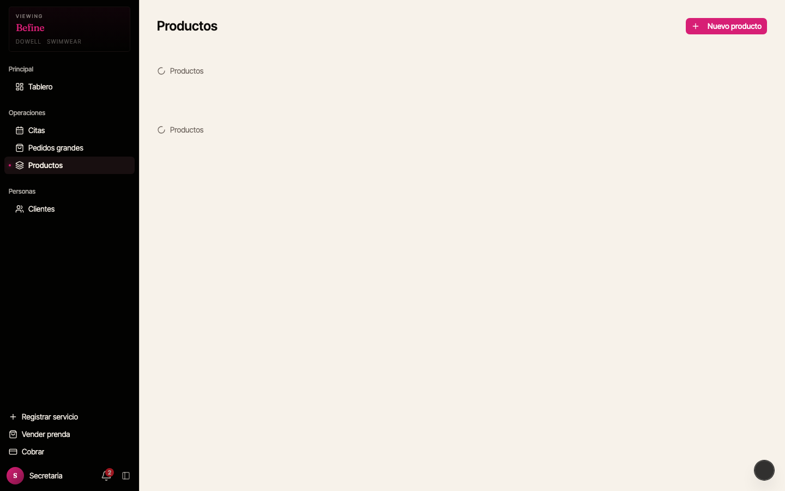

Misma funcionalidad que Admin §2.5. La Secretaria puede:

- Ver el tablero de lotes (Hoy / En progreso).
- Crear nuevos lotes de producción.
- Editar notas de piezas.
- Aprobar piezas completadas.

---

### 4.4 Citas (`/secretary/appointments`)

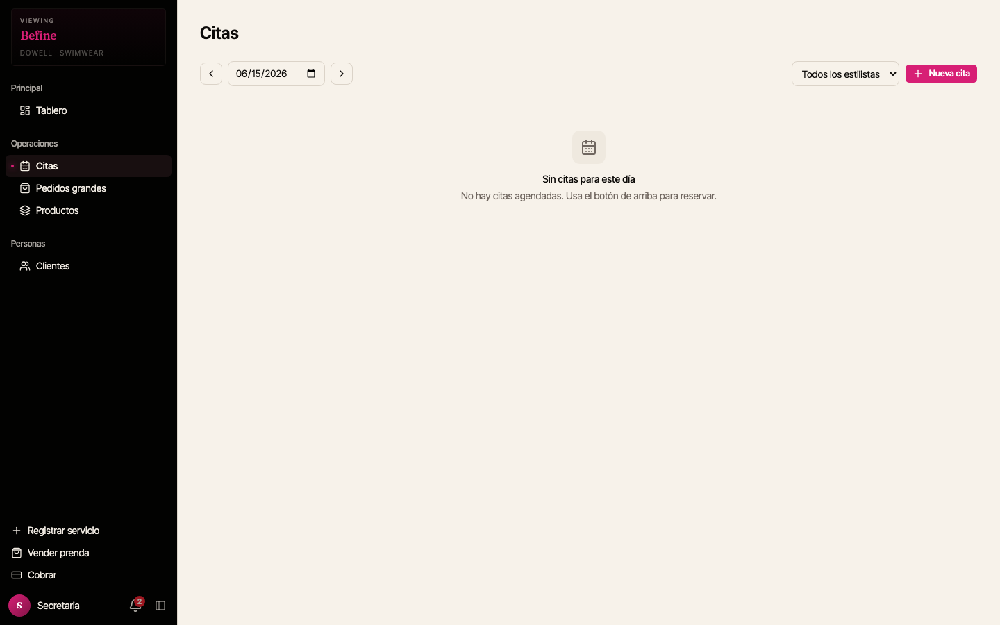

La pantalla de citas es la herramienta principal de la Secretaria.

**Qué muestra:**

- Lista de citas del día con estado y horario.
- Vista de calendario semanal (opcional).

**Acciones disponibles:**

| Acción         | Descripción                                                                                                                                    |
| -------------- | ---------------------------------------------------------------------------------------------------------------------------------------------- |
| **Nueva cita** | Selecciona estilista, servicio, variante, fecha/hora, clienta. El sistema valida que no haya otra cita en ese horario para la misma estilista. |
| **Confirmar**  | La clienta confirmó asistencia.                                                                                                                |
| **Completar**  | La cita se realizó correctamente.                                                                                                              |
| **No show**    | La clienta no llegó.                                                                                                                           |
| **Cancelar**   | Cancela con motivo. Requiere confirmación.                                                                                                     |
| **Reagendar**  | Cambia la fecha y hora. El sistema re-valida disponibilidad.                                                                                   |

> **Alerta de precio:** Si el precio de la variante cambió desde que se agendó la cita, aparece una alerta para que la Secretaria confirme el nuevo precio antes de completarla.

---

### 4.5 Mis ganancias (`/secretary/earnings`)

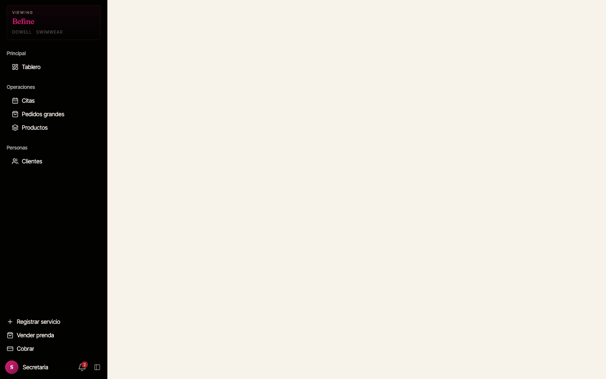

Resumen de las ganancias de la Secretaria.

**Qué muestra:**

- Desglose por día laboral: fecha del día, tarifa diaria, si se marcó como ausencia.
- Total acumulado del período.

**Nota:** La ganancia de la Secretaria se calcula como `días_trabajados × tarifa_diaria`. Los días de vacaciones o ausencias aprobadas no cuentan.

---

### 4.6 Clientes (`/secretary/clients`)

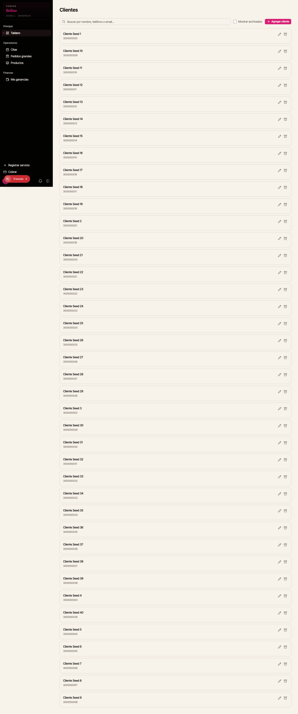

Directorio de clientes registrados en el sistema.

**Qué muestra:**

- Lista de clientas registradas: nombre, teléfono, fecha de registro.
- Clientas archivadas en sección separada.

**Acciones disponibles:**

| Acción            | Descripción                                                               |
| ----------------- | ------------------------------------------------------------------------- |
| **Nueva clienta** | Nombre (obligatorio), teléfono, notas adicionales.                        |
| **Editar**        | Modifica nombre, teléfono o notas.                                        |
| **Archivar**      | Desactiva a la clienta (no aparece en buscadores). Requiere confirmación. |
| **Buscar**        | Búsqueda en tiempo real por nombre o teléfono.                            |

> El **Admin** también tiene acceso al directorio de clientes en `/cashier/clients`.

---

## 5. Estilista

La Estilista usa el sistema principalmente en su **teléfono móvil**. La interfaz usa una barra de navegación inferior en lugar de la barra lateral.

---

### 5.1 Mis tickets (`/stylist`)

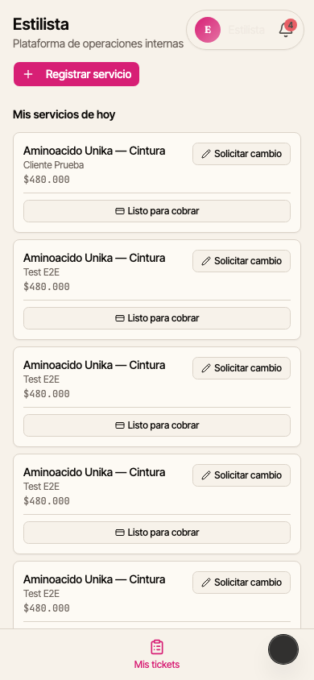

Pantalla de inicio de la Estilista. Muestra sus tickets activos del día.

**Qué muestra:**

- Lista de tickets del día asignados a ella: cliente, servicio, precio, estado.
- Botón **"Nuevo ticket"** para registrar cuando llega una clienta.
- Sección de solicitudes de edición enviadas (si hay alguna pendiente de aprobación).

**Acciones disponibles:**

| Acción                | Descripción                                                                                                  |
| --------------------- | ------------------------------------------------------------------------------------------------------------ |
| **Nuevo ticket**      | Crea un ticket (el sistema la asigna como empleada automáticamente). Selecciona servicio, variante, clienta. |
| **Listo para pago**   | Marca el ticket cuando el servicio terminó. Lo envía al cajero para cobrar. Requiere confirmación.           |
| **Solicitar edición** | Si hay un error en el ticket (servicio o clienta equivocados), envía una solicitud al Admin.                 |

> La Estilista **no puede** cobrar ella misma. El cobro siempre lo hace el Admin o el Cajero.

**Estados de un ticket:**

| Estado          | Descripción                          |
| --------------- | ------------------------------------ |
| Registrado      | Ticket creado, servicio en curso.    |
| Listo para pago | Servicio terminado, esperando cobro. |
| Cerrado         | Cobrado por el cajero.               |

---

### 5.2 Mis ganancias (`/stylist/earnings`)

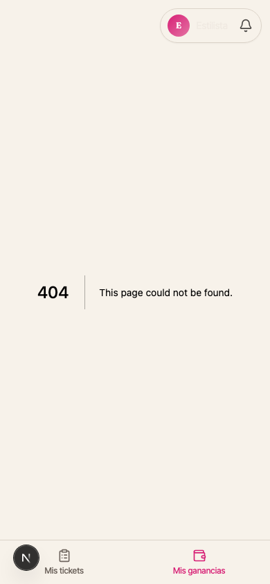

Resumen de comisiones de la Estilista.

**Qué muestra:**

- Desglose por día laboral: fecha, cantidad de tickets, total de comisiones.
- Detalle por ticket: nombre del servicio, precio, porcentaje de comisión, monto ganado.
- Total acumulado del período visible.

**Nota:** La ganancia se calcula como `precio_del_ticket × porcentaje_de_comisión`. El porcentaje es fijo por variante de servicio y lo configura el Admin en el Catálogo.

---

## 6. Confeccionista

La Confeccionista usa el sistema en su **teléfono móvil**, con interfaz de barra de navegación inferior.

---

### 6.1 Mi trabajo (`/clothier`)

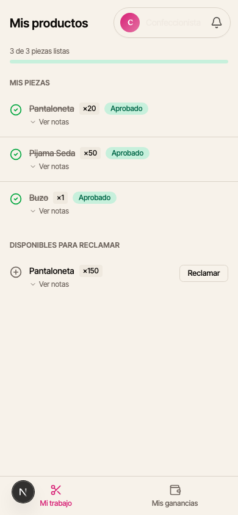

Pantalla de inicio de la Confeccionista. Muestra su tablero de trabajo del día.

**Qué muestra:**

Dos secciones:

- **Asignadas a mí:** piezas que ya tomé para trabajar.
- **Disponibles:** piezas del lote de hoy sin asignar que puedo tomar.

Por pieza se muestra: nombre, cantidad (`×N`), y notas por pieza (color, talla, estilo, instrucciones). Las notas se expanden con un toque.

Barra de progreso general del lote: piezas aprobadas / total.

**Acciones disponibles:**

| Acción                | Descripción                                                                       |
| --------------------- | --------------------------------------------------------------------------------- |
| **Tomar pieza**       | Asigna la pieza a la Confeccionista. Nadie más puede tomarla.                     |
| **Marcar como hecha** | Registra que la pieza fue completada. La envía a revisión. Requiere confirmación. |

**Estados de una pieza:**

| Estado                          | Badge |
| ------------------------------- | ----- |
| Pendiente                       | Gris  |
| En proceso                      | Azul  |
| Hecha (pendiente de aprobación) | Ámbar |
| Aprobada                        | Verde |

> **Lotes auto-aprobados:** si el lote fue creado por el Admin, al marcar la pieza como hecha pasa directamente a **Aprobada** (sin esperar revisión del Admin).  
> **Lotes creados por Secretaria:** la pieza queda en "Pendiente de aprobación" hasta que el Admin o la Secretaria la aprueben.

**Notas de pieza (expandibles):**

Si una pieza tiene color, talla, estilo o instrucciones, aparece el botón **"Ver notas"**. Al tocarlo se expanden los detalles inline sin salir de la pantalla.

---

### 6.2 Mis ganancias (`/clothier/earnings`)

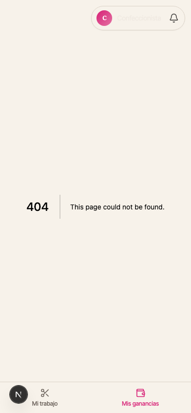

Resumen de ganancias de la Confeccionista.

**Qué muestra:**

- Desglose por día laboral: fecha, piezas aprobadas, monto ganado.
- Detalle por pieza: tipo de prenda, variante, tarifa por pieza.
- Total acumulado del período visible.

**Nota:** La ganancia solo se registra cuando el Admin o la Secretaria **aprueban** la pieza. Las piezas en "Pendiente de aprobación" aún no generan ganancia.

---

## 7. Referencia rápida de accesos por rol

### Mapa de pantallas por rol

| Pantalla                  | Admin | Cajero | Secretaria | Estilista | Confeccionista |
| ------------------------- | :---: | :----: | :--------: | :-------: | :------------: |
| Panel cajero (`/cashier`) |   ✓   |   ✓    |     —      |     —     |       —        |
| Historial tickets         |   ✓   |   ✓    |     —      |     —     |       —        |
| Citas (cashier)           |   ✓   |   ✓    |     —      |     —     |       —        |
| Nuevo ticket (cashier)    |   ✓   |   ✓    |     —      |     —     |       —        |
| Checkout / Cobrar         |   ✓   |   ✓    |     —      |     —     |       —        |
| Panel secretaria          |   —   |   —    |     ✓      |     —     |       —        |
| Citas (secretary)         |   —   |   —    |     ✓      |     —     |       —        |
| Clientes                  |   ✓   |   ✓    |     ✓      |     —     |       —        |
| Pedidos grandes           |   ✓   |   ✓    |     ✓      |     —     |       —        |
| Productos / Confección    |   ✓   |   —    |     ✓      |     —     |       —        |
| Empleados                 |   ✓   |   —¹   |     —      |     —     |       —        |
| Catálogo                  |   ✓   |   —¹   |     —      |     —     |       —        |
| Ausencias                 |   ✓   |   —    |     —      |     —     |       —        |
| Nómina                    |   ✓   |   —    |     —      |     —     |       —        |
| Analíticas                |   ✓   |   —¹   |     —      |     —     |       —        |
| Configuración             |   ✓   |   —    |     —      |     —     |       —        |
| Mis tickets               |   —   |   —    |     —      |     ✓     |       —        |
| Mi trabajo                |   —   |   —    |     —      |     —     |       ✓        |
| Mis ganancias             |   —   |   —    |     ✓      |     ✓     |       ✓        |
| Perfil                    |   ✓   |   ✓    |     ✓      |     ✓     |       ✓        |

¹ El Cajero puede acceder si el Admin activa la opción en Configuración → "El cajero puede acceder a rutas `/admin`".

---

### Acciones por tarea — ¿quién puede hacerlo?

| Tarea                 | Admin | Cajero | Secretaria | Estilista | Confeccionista |
| --------------------- | :---: | :----: | :--------: | :-------: | :------------: |
| Abrir / cerrar día    |   ✓   |   ✓    |     —      |     —     |       —        |
| Crear ticket          |   ✓   |   ✓    |     ✓      |     ✓     |       —        |
| Cobrar (checkout)     |   ✓   |   ✓    |     —      |     —     |       —        |
| Marcar ticket listo   |   ✓   |   ✓    |     ✓      |     ✓     |       —        |
| Agendar cita          |   ✓   |   ✓    |     ✓      |     —     |       —        |
| Gestionar clientes    |   ✓   |   ✓    |     ✓      |     —     |       —        |
| Crear lote/producto   |   ✓   |   —    |     ✓      |     —     |       —        |
| Aprobar pieza         |   ✓   |   —    |     ✓      |     —     |       —        |
| Tomar/marcar pieza    |   —   |   —    |     —      |     —     |       ✓        |
| Crear pedido grande   |   ✓   |   ✓    |     ✓      |     —     |       —        |
| Asignar pieza a orden |   ✓   |   —    |     ✓      |     —     |       —        |
| Registrar pago nómina |   ✓   |   —    |     —      |     —     |       —        |
| Gestionar empleados   |   ✓   |   —    |     —      |     —     |       —        |
| Gestionar catálogo    |   ✓   |   —    |     —      |     —     |       —        |
| Registrar ausencia    |   ✓   |   —    |     —      |     —     |       —        |
| Ver analíticas        |   ✓   |   —¹   |     —      |     —     |       —        |
| Exportar CSV          |   ✓   |   —¹   |     —      |     —     |       —        |
| Cambiar configuración |   ✓   |   —    |     —      |     —     |       —        |

---

### Glosario de términos

| Término                                 | Significado                                                                                        |
| --------------------------------------- | -------------------------------------------------------------------------------------------------- |
| **Día laboral** (`business_day`)        | Período de trabajo abierto por el cajero/admin. Solo puede haber uno abierto a la vez.             |
| **Ticket**                              | Registro de un servicio prestado a una clienta.                                                    |
| **Checkout**                            | Proceso de cobro de uno o más tickets.                                                             |
| **Lote / Producto**                     | Conjunto de prendas a confeccionar asignadas a una o varias confeccionistas.                       |
| **Pedido grande**                       | Pedido de un cliente externo que genera lotes de producción y tiene seguimiento de pagos.          |
| **Liquidación / Nómina**                | Pago registrado a una empleada por sus servicios o piezas del período.                             |
| **Comisión**                            | Modelo de ganancia de Estilistas: porcentaje del precio del servicio.                              |
| **Tarifa por pieza**                    | Modelo de ganancia de Confeccionistas: monto fijo por pieza aprobada.                              |
| **Tarifa diaria**                       | Modelo de ganancia de Secretarias: monto fijo por día laboral trabajado.                           |
| **Cliente registrada** (`saved_client`) | Clienta con perfil en el sistema (nombre, teléfono, historial).                                    |
| **Invitada** (`guest`)                  | Clienta sin perfil; solo se registra su nombre en el ticket.                                       |
| **Precio con override**                 | Precio ajustado manualmente por el Admin para un ticket específico.                                |
| **Auto-aprobado**                       | Lote creado por el Admin en el que las piezas se aprueban automáticamente al marcarse como hechas. |

---

_Última actualización: Junio 2026_
